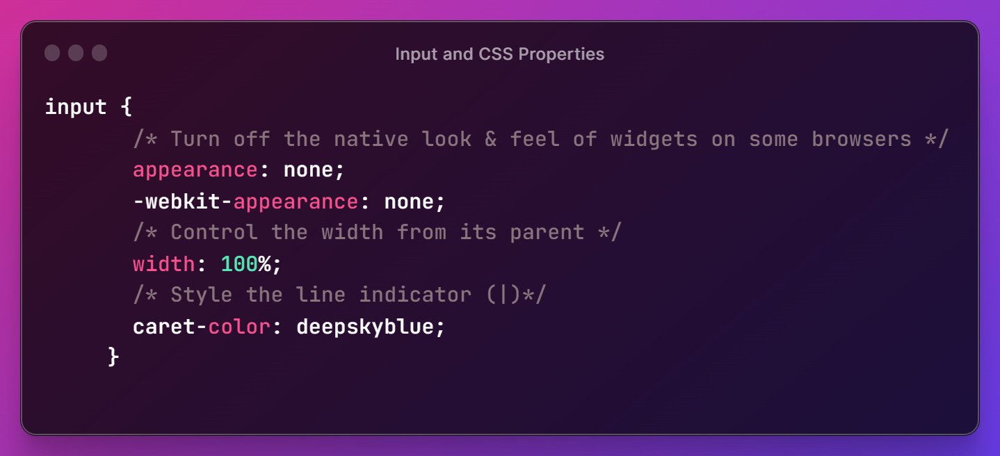
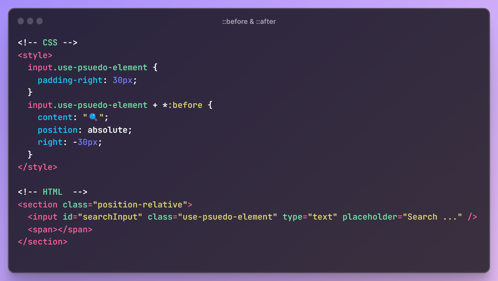
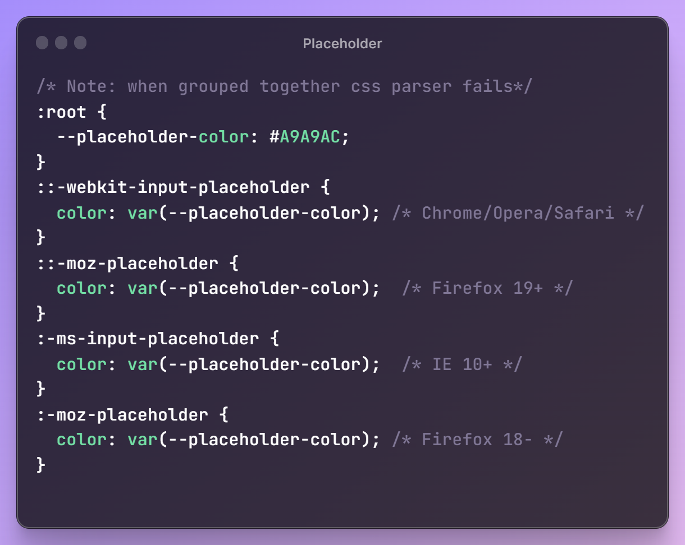
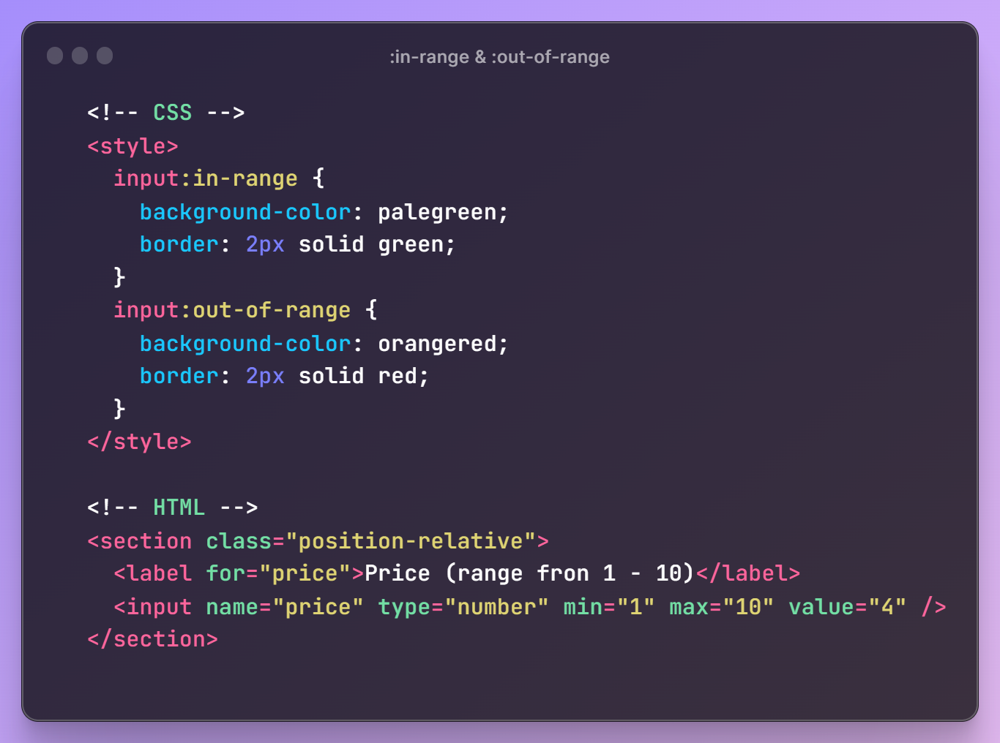

# Styling HTML `<input/>`:

- This article will provide you take a close look on how to style form inputs, it will not include commonly properties.

## Understanding HTML Input:

- By default, input apperance is predefined by user agent (web browser), without any css, that's why it doesn't take the full width of its parent.
- According to MDN, an input element is either a **replaced element** or a **widget** based on its type attribute.
  > HTML spec also says that an <input> element can be replaced, because <input> elements of the "image" type are replaced elements similar to . However, other form controls, including other types of <input> elements, are explicitly listed as non-replaced elements (the spec describes their default platform-specific rendering with the term "Widgets").
  > In certain cases (typically involving non-textual inputs and specialized interfaces), the <input> element is a replaced element.

## Input and CSS Properties:

## Input and Psuedo elemets:

### ::before & ::after

- Similar to all replaced element in HTML, it is not possible to use psuedo elements with input (depending on the type attribute), for example, ::before + after.
- There is a simple trick to use pusedo elements:

- Results:
- Note: adding `padding-right` in case of long text, it won't overlap with the image. it sould be at least the same with of the image.

### ::placeholder

## Input and Psuedo Classes:

### :placeholder-shown:

- `:placeholder-shown` targets input elements that has a placeholder, unlike `::placeholder` which targets the placeholder.
- `:placeholder-shown` can still affect the styling of the placeholder text, since it’s a parent element (e.g. font-size).
- some browsers makes placeholder text of input elements semi-transparent. When setting a custom color for placeholder text, keep in mind that it will appear lighter then the color you used. A way to fix that is adding `opacity:1`;

### :in-range & :out-of-range

- results:

### :valid & :invalid:

- results:

### Resources:

- [Challenges in styling form widget](https://developer.mozilla.org/en-US/docs/Learn/Forms/Styling_web_forms)
- [Debugging CSS by Ahmad Shadeed](https://debuggingcss.com/)
